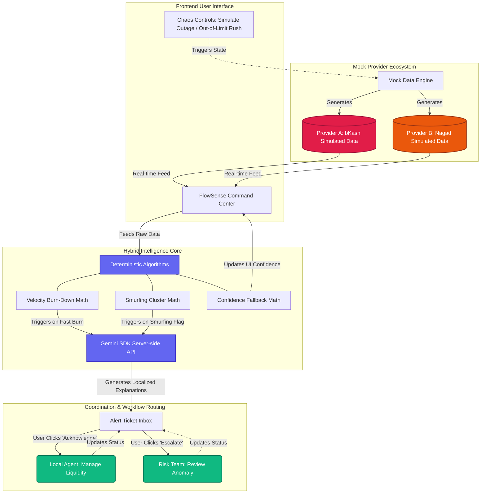

# FlowSense AI 🌐

> **Super Agent Liquidity & Risk Intelligence Platform for Mobile Financial Services (MFS)**
>
> 🚀 Live Production URL: [https://flowsense-ai-aue1.onrender.com/](https://flowsense-ai-aue1.onrender.com/)

---

## 📋 Table of Contents
1. [Project Specifications](#-project-specifications)
2. [Architectural Blueprint](#%EF%B8%8F-architectural-blueprint)
3. [Key Algorithmic Pillars](#-key-algorithmic-pillars)
4. [Local Setup Guide (macOS / Linux)](#-local-setup-guide-macos--linux)
5. [SonarQube Local Docker Scan (macOS Instruction)](#-sonarqube-local-docker-scan-macos-instruction)
6. [Render / Production Cloud Deployment Guide](#-render--production-cloud-deployment-guide)
7. [Git Version Control & Prompt Commit Workflow](#-git-version-control--prompt-commit-workflow)

---

## 📋 Project Specifications

**FlowSense AI** is a real-time, hybrid-intelligence operations dashboard built specifically for Super Agents managing complex liquidity flows across competing MFS providers (e.g., **bKash** and **Nagad**). 

The platform merges high-performance, deterministic mathematical heuristics (run on the client edge for instantaneous response) with generative semantic explanation pipelines (orchestrated server-side via the **Gemini 3.5 Flash** or **1.5 Flash** APIs) to identify, translate, and resolve urgent operational risks.

### Major Capabilities:
*   **Real-time Multi-Provider Stream**: Synthesizes continuous liquidity updates and transaction histories for multiple simulated providers.
*   **Predictive Burn-down Velocity Math**: Dynamically evaluates BDT burn-rates to estimate exact minutes left until balance depletion.
*   **Time-Window Smurfing Heuristics**: Captures structural transaction splitting across critical time windows.
*   **Localized Translation Layer**: Automatically translates complex mathematical anomalies into user-friendly localized contexts (English, Bengali, and Banglish) customized for specific organizational roles (Agents, Field Staff, Risk Analysts, Admin).

---

## 🗺️ Architectural Blueprint

The platform implements a unidirectional high-performance data loop shown below:



---

## ⚡ Key Algorithmic Pillars

### 1. Dynamic Liquidity Burn-Down Math
*   **What it does**: Tracks outbound transactional momentum to prevent unexpected cash depletions.
*   **Mathematical Concept**: Evaluates the cumulative amount of outbound `cash_out` transactions over a sliding interval divided by elapsed time to derive $Velocity_{burn} \text{ (BDT/min)}$. It predicts remaining runway with:
    $$Runway_{mins} = \frac{Balance_{current}}{Velocity_{burn}}$$

### 2. Time-Window Clustering & Smurfing Heuristic (`detectSmurfing`)
*   **What it does**: Detects structural cash splitting to bypass regulatory limits.
*   **Mathematical Concept**:
    *   **Time Horizon**: Constantly monitors a sliding 10-minute window ($10 \times 60 \times 1000 \text{ ms}$).
    *   **Amount Filter**: Looks for transactions with value $A_t$ falling within a tight 5% variance threshold of a critical high-value transaction target ($10,000 \text{ Tk}$):
        $$9,500 \text{ Tk} \le A_t \le 10,500 \text{ Tk}$$
    *   **Clustering Threshold**: Flags an anomaly if three or more transactions ($N \ge 3$) from the same provider fall into a single time-window, and forwards evidence to Gemini for context synthesis.

---

## 💻 Local Setup Guide (macOS / Linux)

Follow these instructions to spin up the full-stack system locally on your machine.

### Prerequisites
*   **Node.js**: v18.0.0 or higher
*   **npm**: v9.0.0 or higher
*   **Git**

### Installation Steps

1.  **Clone the Repository**:
    ```bash
    git clone <your-repository-url>
    cd FlowSense_AI
    ```

2.  **Install Dependencies**:
    ```bash
    npm install
    ```

3.  **Configure Environment Variables**:
    Create a `.env` file in the root directory:
    ```bash
    touch .env
    ```
    Populate the `.env` file with your Gemini credentials:
    ```env
    # .env Configuration
    GEMINI_API_KEY=your_actual_gemini_api_key_here
    PORT=3000
    ```

4.  **Run in Development Mode**:
    ```bash
    npm run dev
    ```
    This launches the Express full-stack backend and hooks up Vite server middleware on [http://localhost:3000](http://localhost:3000).

5.  **Compile the Applet Production Build**:
    ```bash
    npm run build
    ```

---

## 🐳 SonarQube Local Docker Scan (macOS Instruction)

If you are running on a **Mac**, Docker has specific network containment rules. Because macOS runs Docker containers within a hypervisor, `--network="host"` is not supported natively. Follow this step-by-step guide to analyze your code:

### Step 1: Fire up SonarQube Container
Start SonarQube locally on port `9000`:
```bash
docker run -d --name sonarqube -p 9000:9000 sonarsource/sonarqube:community
```

### Step 2: Retrieve your Access Token
1. Open your browser and navigate to `http://localhost:9000`.
2. Log in with Username: `admin` and Password: `admin` (update password upon prompt).
3. Click on **My Account** (top-right avatar) -> **Security** tab.
4. Name a new token (e.g., `FlowSenseScan`) and generate it. Copy the alphanumeric key.

### Step 3: Run the Sonar Scanner on macOS
Since `localhost` inside a Docker container refers to the container itself, use `host.docker.internal` to point back to your Mac host where SonarQube is listening on port `9000`:

```bash
docker run --rm \
  -e SONAR_HOST_URL="http://host.docker.internal:9000" \
  -e SONAR_TOKEN="your_copied_sonarqube_token_here" \
  -v "$(pwd):/usr/src" \
  sonarsource/sonar-scanner-cli \
  -Dsonar.projectKey=FlowSense_AI \
  -Dsonar.projectName=FlowSense_AI \
  -Dsonar.sources=/usr/src
```

*(Note: Replace `your_copied_sonarqube_token_here` with your generated token.)*

---

## ☁️ Render / Production Cloud Deployment Guide

FlowSense AI is set up to run cleanly in high-scale cloud environments like Render.

### Steps to Deploy on Render

1.  **Push Code to GitHub/GitLab**: Create a Git repository and push your project files.
2.  **Create a New Render Web Service**:
    *   Navigate to [Render Dashboard](https://dashboard.render.com).
    *   Click **New** -> **Web Service**.
    *   Connect your Git repository.
3.  **Service Configurations**:
    *   **Name**: `flowsense-ai`
    *   **Runtime**: `Node`
    *   **Build Command**: `npm install && npm run build`
    *   **Start Command**: `npm run start` (or `npx tsx server.ts` depending on package options)
4.  **Environment Variables**:
    *   Under the **Environment** tab, click **Add Environment Variable**.
    *   Key: `GEMINI_API_KEY` | Value: `your_gemini_api_key_from_google`
    *   *(Note: Do not expose this key in your client code. The server-side code resolves it privately!)*
5.  **Confirm Host**: Render will automatically assign a random port via `process.env.PORT` which Express will bind to dynamically. Your app will deploy and go live!

---

## 📝 Git Version Control & Prompt Commit Workflow

To record code changes alongside the prompt context used to generate them, run the following commands sequentially on your terminal:

```bash
# 1. Stage the mathematical core, frontend console, and prompt definition
git add lib/algorithms.ts src/App.tsx .prompts/anomaly-detection.md

# 2. Commit the changes using structured conventional commits
git commit -m "feat(anomaly): implement sliding window clustering math

- Configured Time-Window Clustering algorithm (N >= 3, 5% variance limit).
- Renamed interface trigger button to 'Simulate Anomaly Detection'.
- Documented prompt context in .prompts/anomaly-detection.md."

# 3. Push to your live upstream production repository
git push origin main
```
